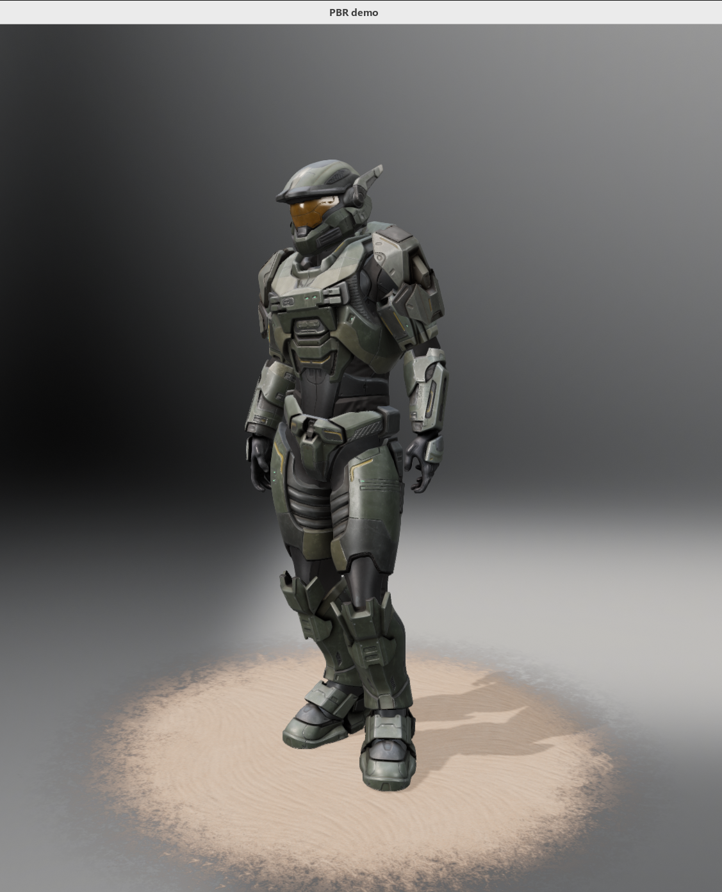

# A PBR demo with filament

# Build 
```
1. change from "#include <SDL.h>" to "#include <SDL2/SDL.h>" in file FilamentApp.h
2. remove libstb.a from libs of filament, use the system default installing from apt
```
